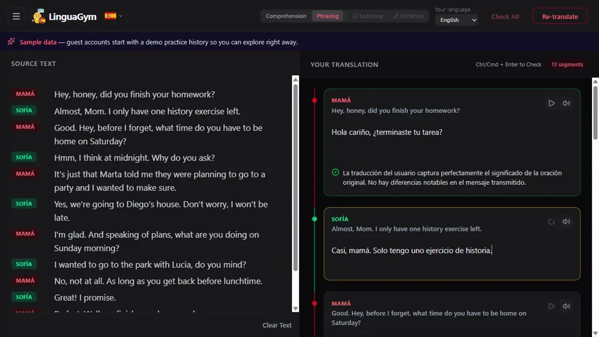
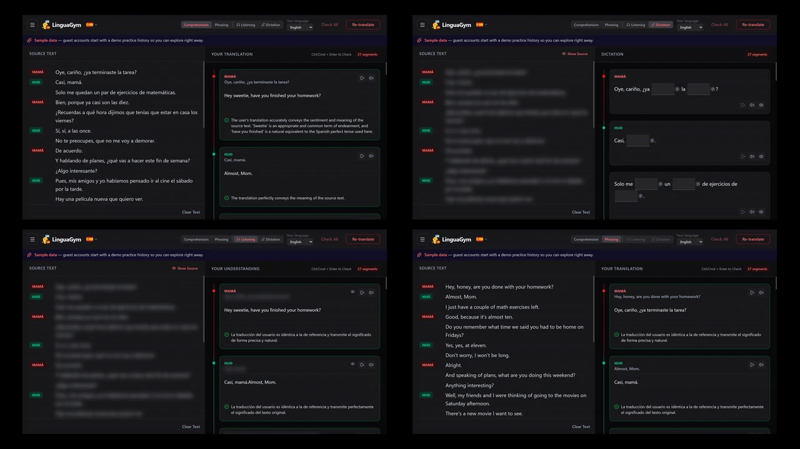
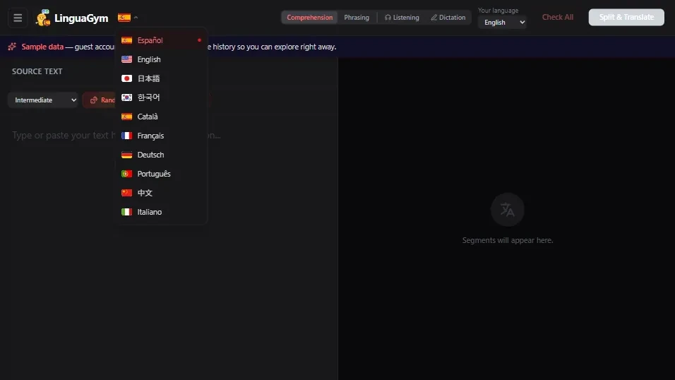
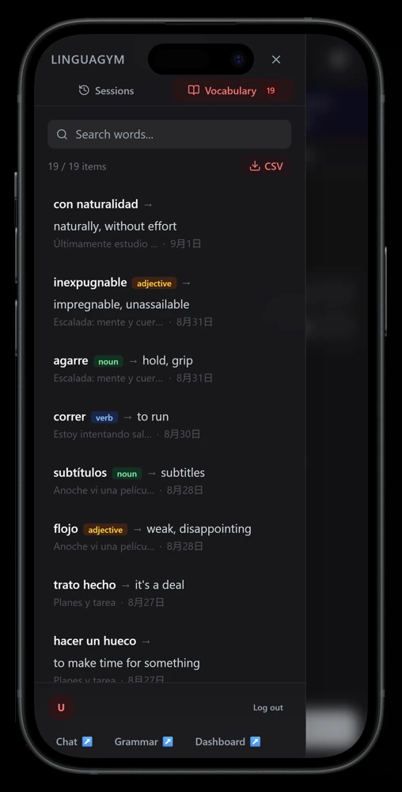

# LinguaGym

**AI-assisted translation gym — paste any text (or have AI generate an article or dialogue skit for you), get it segmented and translated, then train your comprehension, phrasing, listening, and dictation against it.**

LinguaGym turns any text in 10 languages into a personal translation workout. An LLM splits the text into bite-sized segments with reference translations, and every answer you give is graded segment by segment (green / yellow / red) with concise feedback in your native language. Don't have a text handy? Generate one — a themed article or a multi-speaker dialogue skit at your difficulty level.

**Live:** https://linguagym.pekobit.com/

<p align="center">
  
</p>

<p align="center">
  
  
</p>

<p align="center">
  
</p>

<p align="center"><sub>Segment-by-segment grading · the four practice modes and the ten study languages · the vocabulary list. Screens show the guest demo data.</sub></p>

## Features

- **AI segmentation & reference translations** — source text is split into meaningful segments (clause-aware, length-tuned per language, CJK-aware) with a reference translation for each; overly long segments are automatically re-split
- **Four practice modes**
  | Mode | What you train |
  |---|---|
  | Comprehension | Read the foreign text, write what it means in your language — graded on understanding, not phrasing |
  | Phrasing | Reverse drill: see your language, produce the foreign text |
  | Listening | Hear each segment via TTS instead of reading it, then translate |
  | Dictation | AI-generated cloze (fill-in-the-blank) exercises with per-blank scoring and hints |
- **Per-segment AI grading** — green / yellow / red status with a 1–2 sentence explanation and a suggested improvement, localized to your native language
- **Text generation** — random themed articles or 2–3 speaker dialogue skits (daily / business / intellectual / narrative) across four difficulty levels (A1–C2), with speaker labels parsed into the practice view
- **Vocabulary book** — select any word or phrase to look it up and save it; single words are normalized to their dictionary form (lemma + part of speech) by an LLM in the background, and the whole book exports to CSV
- **10 languages** — Spanish, English, Japanese, Korean, Catalan, French, German, Portuguese, Chinese, Italian; the first five come with their own UI color theme
- **Sessions & progress** — every practice session autosaves with per-segment check status; the sidebar shows a progress ring per session, with pin / rename / delete
- **Guest mode** — one-click anonymous sign-in to try the app, pre-filled with a two-week sample history: twelve practice sessions across all four modes and seven study languages, so the sidebar, the progress rings and the vocabulary book are populated from the first screen; guest data is wiped automatically after 24 hours by a scheduled Supabase Edge Function
- **PWA** — installable, mobile-first responsive layout
- **Part of a learning ecosystem** — shares its Supabase backend (auth, vocabulary, study data) with **LinguaCoach**, a companion AI conversation tutor; segment check results feed LinguaCoach's learning dashboard, and cross-app navigation links the two

## How it works

```
source text ──► /api/translate (LLM: segment + reference translation)
   │                                │
   │  or generated:                 ▼
   │  /api/generate          Segment cards ◄──── cloze generation
   │  (article / skit)              │            (dictation mode)
   │                                ▼
   └──────────────►  user answers, per segment
                                    │
                                    ▼
                     /api/check · /api/check-dictation
                     (LLM grading: status + reason + suggestion)
                                    │
                                    ▼
                     debounced autosave ──► Supabase (RLS)
                                    │
                                    ▼
                     session list & progress rings (sidebar)
```

- All AI calls go through **OpenRouter** (Gemini 2.5 Flash for grading and cloze design, Flash-Lite for bulk segmentation and text generation) on Edge runtime routes.
- All database access is server-side only: route handlers authenticate the user via Supabase SSR cookies, then query with per-user scoping; Row Level Security backs this up at the database layer.
- The session list API returns lightweight summaries (title, languages, progress counts) — full segment bodies are only fetched when a session is opened.
- Saves are serialized client-side and written as *upsert-then-prune* on the server, so a failed or racing write can never wipe a session's segments.

## Tech stack

| Layer | Technology |
|---|---|
| Frontend | Next.js 16 (App Router), React 19, TypeScript, Tailwind CSS v4 |
| AI | OpenRouter (Gemini 2.5 Flash / Flash-Lite) |
| Backend / DB | Supabase (Postgres, RLS, Auth incl. anonymous sign-in, Edge Functions) |
| Auth | Google OAuth + guest (anonymous) sessions via Supabase Auth |
| Speech | Web Speech API (default), optional OpenAI TTS provider |
| PWA | @ducanh2912/next-pwa (service worker, installable) |
| Infra | Vercel |

Flag icons by [Flagpack](https://flagpack.xyz/) (MIT).

## Local development

```bash
git clone https://github.com/Peko-Peko-Bit/lingua-gym-public.git
cd lingua-gym
npm install

# create .env.local — see required keys below
npm run dev   # http://localhost:3000
```

Required keys in `.env.local`:

| Key | Purpose |
|---|---|
| `NEXT_PUBLIC_SUPABASE_URL` / `NEXT_PUBLIC_SUPABASE_ANON_KEY` | Supabase project |
| `SUPABASE_SERVICE_ROLE_KEY` | server-side DB access from route handlers |
| `OPENROUTER_API_KEY` | all AI features (segmentation, grading, generation) |
| `ALLOWED_EMAILS` | comma-separated allowlist for Google sign-in; unset rejects every Google sign-in (guest mode is unaffected) |

Optional: `NEXT_PUBLIC_COOKIE_DOMAIN` (cross-subdomain auth with LinguaCoach), `NEXT_PUBLIC_CHAT_URL` / `NEXT_PUBLIC_GRAMMAR_URL` / `NEXT_PUBLIC_DASHBOARD_URL` (cross-app nav links), `NEXT_PUBLIC_TTS_PROVIDER=openai` (OpenAI TTS instead of Web Speech).

Database schema and migrations live in [supabase/](supabase/); the guest-cleanup job is in [supabase/functions/cleanup-guest-data/](supabase/functions/cleanup-guest-data/).

The guest sample history is frozen in [data/demo/](data/demo/) and inserted on first entry by [lib/guest-seed.ts](lib/guest-seed.ts) — no LLM call. The fixtures themselves were produced once by driving the real API routes, so the reference translations, the gradings and the cloze exercises are genuine model output; [scripts/](scripts/) holds that pipeline (`generate-demo-sources` → `author-demo-answers` → `grade-demo-sessions` → `freeze-demo-sessions`) and its blueprint. Every demo source text comes from the app's own `/api/generate`, so no third-party text is bundled.

## Deployment

Deployed on **Vercel** — push to `main` triggers a production build. Supabase hosts the database, auth, and the scheduled Edge Function that purges expired guest accounts. The PWA service worker is enabled in production builds only.

## About this repository

This is a public mirror of the private repository LinguaGym is developed in. It is updated by snapshot, so the history here is one commit per sync rather than the development history, and a small number of files are not included. Issues and pull requests are welcome, but changes are applied upstream and arrive here with the next sync.

Licensed under the [MIT License](LICENSE).
